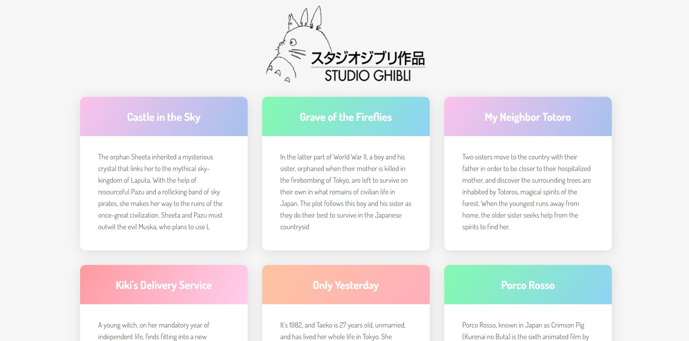
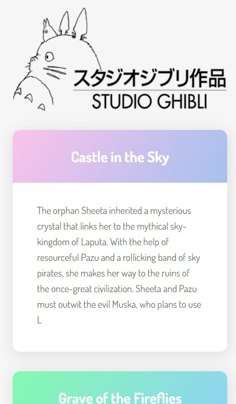

# Dev-Portfolio-Final

This is a solution to Tania Rascia's [How to Connect to an API with JavaScript](https://www.taniarascia.com/how-to-connect-to-an-api-with-javascript/).

## Table of contents

- [Overview](#overview)
  - [The challenge](#the-challenge)
  - [Screenshot](#screenshot)
  - [Links](#links)
- [My process](#my-process)
  - [Built with](#built-with)
  - [What I learned](#what-i-learned)
- [Author](#author)

## Overview

### The challenge

Users should be able to:

- View the optimal layout for the app depending on their device's screen size
- View Studio Ghibli film titles and descriptions, provided by an API

### Screenshot

### Links

- Solution URL: https://github.com/kowai-onigiri/Studio-Ghibli-API-Tutorial
- Live Site URL: https://kowai-onigiri.github.io/Studio-Ghibli-API-Tutorial/

## My process

### Built with

- Semantic HTML5 markup
- CSS custom properties
- Flexbox
- JS DOM manipulation
- API

### What I learned

- practice with responsive techniques
- practice with DOM manipulation
- how to use API in JavaScript

## Author
- Tutorial Design: Tania Rascia
- Tutorial Completed by: Alexis Chambers (@kowai-onigiri)
